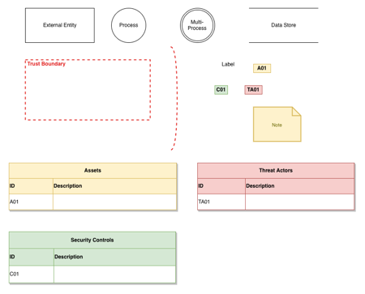
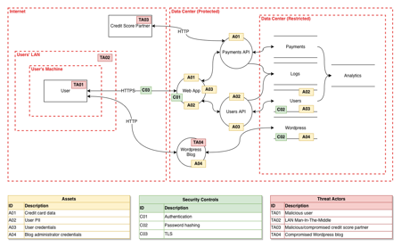
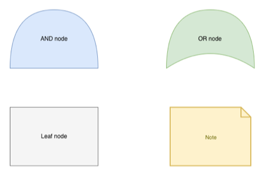
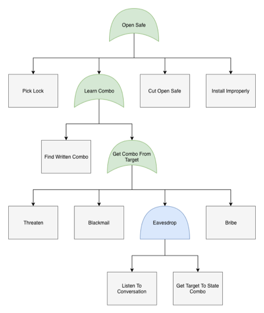

I've spent a good amount of time lately trying to find a good tool for threat model diagramming. I defined a couple of requirements and started assessing what was out there:

* **Support for Data Flow Diagrams (DFD) and Attack Trees:** I believe these are essential for threat modeling. Sequence Diagrams are a plus too.
* **Enjoyable and easy to use:** It must be easy to create diagrams and no weird bugs to make it clunky or cumbersome to work with. This is important, not only for my own sanity, but also for getting developers to adopt the practice. If you don't provide them with a good tool, they probably won't do it.
* **Free and cross-platform:** It must be free and work on Windows, Mac and Linux. If the tool only works on Windows or you have to juggle licenses, it makes it much harder to introduce threat modeling in an organization.
* **Not web or "Cloud" based:** It should feel like a proper desktop application and storage should be good old local files. Cloud (a.k.a. someone else's computer) can be nice, but not for threat modeling. File based storage also makes it easy to check the diagrams into version control and make it live next to the code.

I checked out quite a lot of different tools but none of them fulfilled the requirements. Many didn't have elements for DFDs and Attack Trees, [Microsoft Threat Modeling Tool](https://www.microsoft.com/en-us/download/details.aspx?id=49168) only runs on Windows, [Threat Modeler](https://threatmodeler.com/) is web based, [Threat Dragon](https://threatdragon.org/) felt awkward to work with, and [Dia](http://dia-installer.de/index.html.en) is old, clunky and buggy.

I was pretty dissapointed with what I found, so I scratched my own itch and started work on a new Electron based app which I hoped would be the perfect fit for me, and hopefully many others. Doing the initial research for this, I came across the [mxgraph](https://github.com/jgraph/mxgraph) project which seemed to be the perfect core diagramming component. Then I saw that it was used as part of a tool called [draw.io](https://www.draw.io/) and that luckily turned out to be the perfect fit, with a bit of configuration and customization...

## DFD and Attack Trees in draw.io

Draw.io doesn't come with dedicated libraries for DFDs and attack trees, but it has all the elements. They are just spread across several different libraries. After playing around with the tool for a bit, I discovered that it's super easy to customize elements and adding them to custom libraries which can be exported for easy reuse. I created two new libraries with all you need for DFD and attack trees and [put them up on Github](https://github.com/michenriksen/drawio-threatmodeling).

## Data Flow Diagrams

These are the elements available in the `dfd.xml` library:

<figcaption class="caption">All elements in the DFD library.</figcaption>

Apart from the classic DFD elements, the library also contains a note element, labels for assets, threat actors, security controls, and convenient tables for documenting them directly in the diagram.

To show you how it all works together, I've created a diagram of a simple, fictitious system:

<figcaption class="caption">A DFD of a simple, fictitious system.</figcaption>

## Attack Trees

These are the elements available in the `attack-tree.xml` library:

  
  <figcaption class="caption">All elements in the DFD library.</figcaption>

To show you how these work together, I have recreated the classic *Open Safe* attack tree:

  
  <figcaption class="caption">An attack tree exploring how to open a safe.</figcaption>

## Getting set up

1. [Download](https://about.draw.io/integrations/#integrations_offline) and install draw.io for your operating system
2. Clone or download the [Github repository](https://github.com/michenriksen/drawio-threatmodeling)
3. Open draw.io application and create a new blank diagram
4. Click the *File* menu and then click *Open Library...*
5. Navigate to where you put the Github repository and open one of the XML files

Congratulations! You are now ready to threat model. To make draw.io even nicer, I can recommend turning on the *Minimal* theme by clicking the *Extras* menu and selecting the Minimal theme. This makes the UI cleaner and gives more space for actual diagramming.

I hope that you will find this helpful and make it easier and more joyful to threat model for you and your team.
