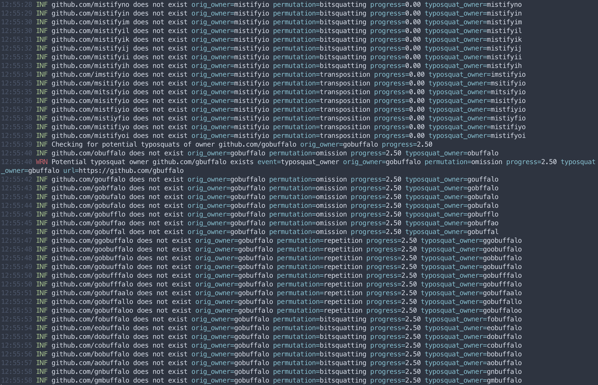
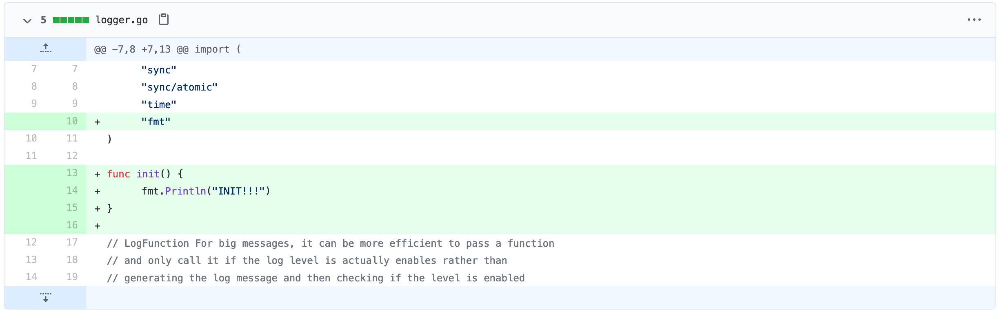
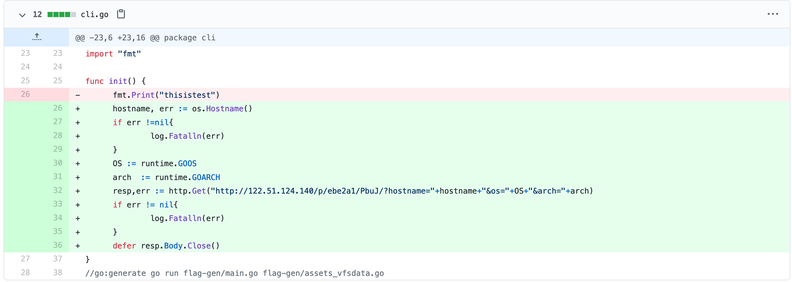

Because of the big [SolarWinds hack](https://en.wikipedia.org/wiki/2020_United_States_federal_government_data_breach) and the recent blog post describing a new [Dependency Confusion attack](https://medium.com/@alex.birsan/dependency-confusion-4a5d60fec610), there has been a lot of talk lately about supply chain attacks, the sneaky technique of compromising less secure elements in a supply chain to compromise more secure targets.

A popular target for supply chain attacks has always been the many package management systems for popular programming languages such as NPM for JavaScript, Rubygems for Ruby, and PyPI for Python. These systems have been plagued for years by malicious actors uploading malicious packages and waiting for victims to install them.

I haven't heard much talk about how the situation looks for the Go ecosystem, and since Go is my new language of choice, I decided to do some investigation.

The novel [Dependency Confusion attack](https://medium.com/@alex.birsan/dependency-confusion-4a5d60fec610) vector is luckily not something a Go developer has to worry about since the source is always explicitly specified when importing a package, so when Go fetches the external dependency, it can't be confused about where to fetch it:

```go
import "github.com/stretchr/testify"
```

There is however still a possible attack vector via simple [typosquatting](https://en.wikipedia.org/wiki/Typosquatting) where the attacker exploits the fact that people often hit the wrong keys when typing on their keyboard. This could both be done on the host domain where the attacker registers a common typo of github.com, but even easier would be to simply register a new user on GitHub, or any other open package host, with a common typo of the package owner's username.

With this in mind, I set out to build a tool that would help me uncover potential typosquat packages in the wild:

1. Take a large list of Go package import paths (e.g. `github.com/stretchr/testify`)
2. Permutate the username of every unique package owner to get a list of potential typosquats
3. Check if any of the typosquat users exists on the platform
4. If a potential typosquat user is found, retrieve all of their repositories
5. Log any of the repositories that have a name equal to the original packages being checked

This resulted in a new tool I call `pkgtwist` which is [available on GitLab](https://gitlab.com/michenriksen/pkgtwist) (the name is inspired by the awesome [dnstwist](https://github.com/elceef/dnstwist) tool)  if you are interested in doing your own evil Go package hunting.

## Permutations

Probably the most important part of `pkgtwist` was the generation of good username permutations in order to have the best chance of detecting typosquats. A bit of research led me to [zntrio/typogenerater](https://github.com/zntrio/typogenerator) which looked like the perfect package for generating potential username typos. The package implements a pretty long list of permutation strategies that I picked a few from so that pkgtwist only spends time on checking what I feel are the most likely typosquats:

 - **Omission:** removal of a single character (missing a keypress, `stretchr` => `strechr`)
 - **Repetition:** repetition of characters (pressing a key twice, `gobuffalo` => `gobuffallo`)
 - **[Bitsquatting](https://en.wikipedia.org/wiki/Bitsquatting):** possible bit-flip errors (`stretchr` => `strftchr`)
 - **Transposition:** swapping of adjacent characters (pressing keys in the wrong order, `stretchr` => `strethcr`)

This means that if pkgtwist is given the package `github.com/stretchr/testify` as input, it will check if any of the of following users exist on GitHub, and if they do, check if they have also have a repository called `testify`:

`tretchr` `sretchr` `stetchr` `strtchr` `strechr` `strethr` `stretcr` `stretch` `sstretchr` `sttretchr` `strretchr` `streetchr` `strettchr` `stretcchr` `stretchhr` `stretchrr` `rtretchr` `qtretchr` `ptretchr` `wtretchr` `vtretchr` `utretchr` `ttretchr` `suretchr` `svretchr` `swretchr` `spretchr` `sqretchr` `srretchr` `ssretchr` `stsetchr` `stpetchr` `stqetchr` `stvetchr` `stwetchr` `sttetchr` `stuetchr` `strdtchr` `strgtchr` `strftchr` `stratchr` `strctchr` `strbtchr` `streuchr` `strevchr` `strewchr` `strepchr` `streqchr` `strerchr` `streschr` `stretbhr` `stretahr` `stretghr` `stretfhr` `stretehr` `stretdhr` `stretcir` `stretcjr` `stretckr` `stretclr` `stretcmr` `stretcnr` `stretcor` `stretchs` `stretchp` `stretchq` `stretchv` `stretchw` `stretcht` `stretchu` `tsretchr` `srtetchr` `stertchr` `strtechr` `strecthr` `strethcr` `stretcrh`

## Subjects

Next up was to find a list of packages to check. Initially, I thought about finding some sort of "Top X Go packages" list, but I couldn't really find a good resource for that, so I ended up running pkgtwist against every github.com and gitlab.com hosted packages from the [Go Module Index](https://index.golang.org/index) (731 packages in all).

## Results

<a href="pkgtwist_1.png"></a>
<figcaption class="caption">pkgtwist running in verbose mode.</figcaption>

After several hours of crunching through the 731 packages, pkgtwist finished with a list of 7 potential typosquat packages to investigate further. I honestly expected the list to be bigger, but I was of course happy to see that the Go ecosystem isn't completely infested (yet) with malicious typosquat packages.

There were however a couple of typosquat packages that jumped out at me...

### github.com/siruspen/logrus ⚠️

The [logrus](https://github.com/sirupsen/logrus/) package by [sirupsen](https://github.com/sirupsen) is a very popular logging package (17.3k stars on GitHub) that many Go projects use, which obviously makes it a target for a typosquat supply chain attack. So when I saw that the user `siruspen` (notice the letter swapping) had a similarly named repository, I quickly checked out what it was doing.

It turns out that the project is a fork of the original `logrus` repository, so doing a comparison to find the differences was pretty easy. At the time of writing, the only thing that is added to the potential typosquat repository, [is a small init function](https://github.com/sirupsen/logrus/compare/master...siruspen:master#diff-ff87b7c4777a35588053a509583d66c9f404ccbea9e1c71d2a5f224d7ad1323eR13-R16) with a single `Println` call:

<a href="sirupsen_logrus.png"></a>
<figcaption class="caption">Comparing siruspen/logrus with the original repository.</figcaption>

While this is not malicious in any way it could very quickly be changed by the owner in the future, so I will definitely keep an eye on this repository. I would also recommend double-checking your projects if you use `logrus` to make sure you're not using this package instead of the real one!

### github.com/utfave/cli ⚠️

[urfave/cli](https://github.com/urfave/cli) is another popular Go package (15.4k stars on GitHub) for building CLI projects. So when I saw the user `utfave` also had a repository called `cli`, my alarm bells went off and I investigated further.

It turns out that the [second-last commit](https://github.com/utfave/cli/commit/4af15496c49f613503d37d43b99df767f831bae1#diff-8d9ca23280f24fe6444d03ae46e7a15dd152170f32f57f978dfbdfd3cfe8ff55L26-R36) introduces a highly suspicious `init` function:

<div class="thumb-image">
  <a href="utfave_cli.png"></a>
  <figcaption class="caption">Ohai there, 122.51.124.140...</figcaption>
</div>

It looks like the author `utfave` wants to know the hostname, operating system, and architecture of all the machines using their version of `urfave/cli`. The function extracts the system information and then calls out to the IP address `122.51.124.140` belonging to the Chinese company Shenzhen Tencent Computer Systems via HTTP with the system information added as URL parameters.

While this code won't give them any access to systems, it's highly suspicious that they collect this information and the actor can quickly change this code to call back with a reverse shell if they identify a system to be valuable or interesting.

I reported this repository to GitHub and hope to see it taken down in the near future. Until then, I recommend double-checking your projects if you use the `urfave/cli` to make sure you're not using the typosquatted version.

## Conclusion

While my little research project didn't cover every single Go package out there, I feel it covered enough to give a rough picture of what the supply chain attack situation looks like for the Go ecosystem. The two repositories `siruspen/logrus` and `utfave/cli`, were the only ones out of the 7 flagged repos that really worried me, but I will keep a close eye on the rest as they could in theory become malicious at any time.

I think Go is in a better situation than other programming languages because the source of packages is always explicitly written every time they are used, but code editor automation could make typosquat attacks more likely to happen as the developer doesn't write the import paths manually as often. As an example, if the popular [Go extension](https://marketplace.visualstudio.com/items?itemName=golang.Go) for [VS Code](https://code.visualstudio.com/) is installed, a developer will typically only type a package import on the first usage, and then the editor will automatically add the import in any other files as soon as the package name is used. If the developer mistypes the import path the first time, a malicious package could be introduced and live for a long time in a Go project before it's discovered.
